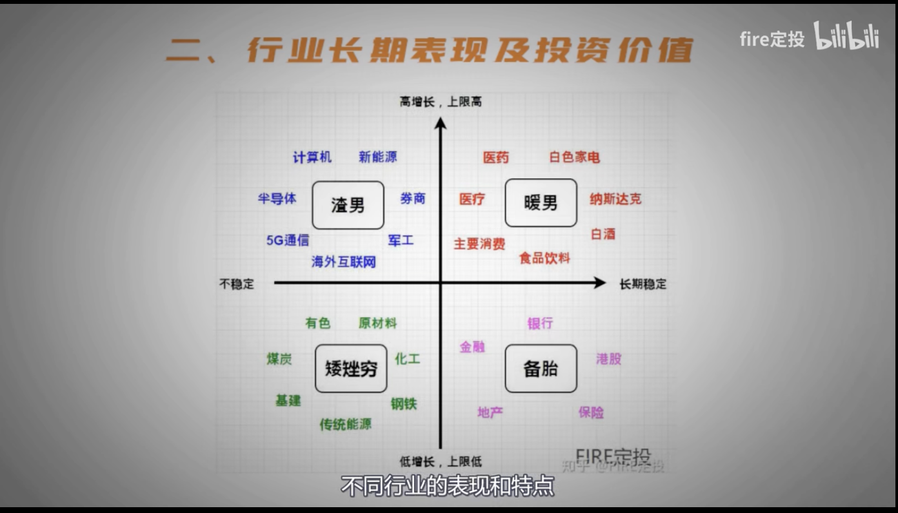

# 基金

## 指数基金与主动型基金

### 指数基金

指数基金是被动投资，模仿指数买入相应的成分股，无需人为操作，只需要尽可能复制指数。

指数基金是投资“指数”，收益表现完全排除掉基金经理的干预，完全取决于指数。

### 主动型基金

主动基金持仓股票与权重分配完全由基金经理管理，一般会选择一个对标指数作为基准，经理通过精选个股/调整持仓股票以及仓位管理等方式争取获取高于基准的超额表现。

主动型基金相当于投资基金经理的个人能力，基金经理的管理能力决定基金收益表现。基金操作对投资者是半透明的，定期公开。

### 主要区别

两者的主要区别在于是否人为干预：

- 是否可以自由选股
- 是否可以自由调整仓位

指数基金依赖市场整体表现，赚的是市场的平均收益，长时间保持95%高仓位运行，即使是可预见的下跌行情，基金经理不会降低仓位来控制回撤

主动型基金，收益于基金经理的能力相关，可以通过调低仓位来应对下跌行情

### 适合场景

1. 行业细分程度

- 宽基基金：主动
- 单一行业基金：指数，主动
- 细分的行业：指数优于主动，如科技下细分的半导体行业

原因分析：

- 行业分散的宽基选股范围够大，操作上限高（如：富国天惠，兴全趋势 > 沪深300）
- 单一行业基金：投资主动超额收益有限
- 更细分行业：股票很少，操作空间有限，主动基金还有高额运作费

2. 初学者建议从指数开始

指数更适合感受市场，构建投资体系

3. 场外基金适合长期持有，投主动基金更好，场内中短波段投指数ETF更好

场外：多数主动基金的波动率和最大回撤都会低于指数基金

场内：ETF基金。主动基金除了少数 LOF 基金外不能在场内交易

## 行业板块分类

行业基金：高风险高收益，需要了解以下方面：

- 风险等级
- 经济大环境相关度
- 对外部环境敏感程度

### 行业分类与特性

1. 防御型行业

受经济大环境的影响比较小，如：主动消费，医疗健康，电信服务。

具备长牛属性，可长期持有，尤其是在经济环境不好，外部环境充满不确定性时。增长稳定，长期回报率也远超其他指数。

2. 周期型行业

涨跌几乎完全取决于经济大环境的好坏，如：金融地产，可选消费。

第一种：低点提前买入，坚定持有，高点卖出。安全边界极高，回报率不会低，但是投资周期会非常长。

第二种：转换期进场，需要对行业有一定的敏感度，能准确捕捉到进场时机

3. 敏感型行业

短期极容易受到消息面的影响，如：科技类，能源类，工业。

更具备进攻属性，需要对现景和瓶颈有一定了解，对事件/消费敏感。

### 行业分析

1. 行业分类标准及覆盖领域

中证指数公司的行业分类标准：把国内分为10个一级行业：能源，原材料，工业，可选消费，主要消费，医药卫生，金融地产，信息技术，电信业务，公共事业

2. 行业长期表现及投资价值

- 第一象限：应作为持仓的首选，持有周期也应该更长
- 第二象限：不应该作为重仓，持仓比例不宜过高，更适合在相对低点提前布局，热度和点位过高时，及时卖出止盈
- 第三象限：尽量远离
- 第四象限：不建议场外长期持有，在市场整体下行时，作为一个避险的选择

## 投资切忌追涨杀跌

合理制定持仓：

- 纯债基金：最稳健的对冲手段，大多数的纯债基金最大回撤都不超过 2%，如：易方达裕丰回报债券
- 偏股基金

### 机构的抱团行为

券商：筛选不具备深入价值的股票，放弃超过 50%，2000只左右

基金公司：基于券商提供的数据，研究员进一步研究精选，组成核心研究池，最终给基金经理研究并作出投资决策

基金经理：达到基金经理手上的差不多也就几百只

- 层层筛选意味着更专业更优秀，利用公募基金对行业和个股的整体判断，可以参考重仓的行业板块
- 公募基金抱团现象不是如今特有
- 顺应趋势，但不要过度迷恋某个板块，保持明星基金重仓行业关注
- 优选板块比死盯估值更重要

正确的做法：

- 首先，精选出优秀的行业或者指数，例如：主要消费，中证白酒，中证医疗，CS新能车，沪深300，创业板50，筛选长期表现悠闲的作为投资备选
- 随后，根据估值的高低来判断该指数是便宜还是贵，低估时提前布局，高估时减仓降低风险锁定收益

## K 线入门

### 概念介绍

1. 日 K 线

柱体颜色：只体现了开盘价与收盘价之间的高低关系，红涨绿跌。颜色不能完全由今天的涨跌决定

比如：跳空高开1%，最终以涨0.5%收盘，虽然今天还是涨但是这个柱子颜色是绿色的

柱体：表示价差，价差越大，柱体越高

柱体上下的线：反应的是最高价，最低价

2. 均线

均线：近几日价格的平均值组成的一条线，可以分为短期，中期，长期均线。

均线通常被用来判断短中长期趋势，以及股价上涨时的阻力位，下跌时的支撑位等信息

3. 成交量

成交量：指某个时间段内，买卖双方成交的股数。

柱子的长短代表成交量的大小，成交量越大，柱子越长

柱子的颜色由股价涨跌决定，股价上涨则显示为红色，股价下跌则显示为绿色

成交量是反应市场热度的重要指标，成交量较大时，股价波动也会较大，成交量萎缩时，股价的波动会趋于平稳。

成交量的增加和股价的上涨往往会同步发生，成交量的减少和股价下跌也会同步发生。

内核还是供求关系的问题，供求决定价格

### 均线技巧

1. 看股价运行趋势的好坏

短期（5日，10日，20日），中期（60日）

- 均线方向一致：向上，看好；向下，看空
- 均线方向不一致
  - 当天数短的均线向上穿过天数长的均线，趋势由坏转好
  - 当天数短的均线向下穿过天数长的均线，趋势由好转坏

2. 用于判断阻力位和支撑位

60日均线：过去60个交易日内买入这只股票或者指数的所有投资着他们的成本价

指数反弹，反弹到60日均线时，被压下，这时股价回到了这段时间内的成本价，大量持有者解套，抛售股票或者基金，阻止股价上涨，能否突破阻力就很关键，除非有重大利好或者市场外的增量资金愿意进场，否则60日均线就会变成阻力位始终难以突破，一旦多次都无法突破，市场热情和信心降至冰点，最终股价会崩盘式下跌。

跌破60日均线，当前价格比过去60个交易日的平均价格要便宜，这时进场可以以较低价格买入，买盘量放大，市场火热，股价就会得以支撑，会迅速反弹恢复强势。但是如果下跌太快，破坏投资者信息，出现恐慌踩踏，那么60日均线也没法支撑，投资者信心不足，交易继续萎缩，就会造成崩盘式下跌。

总结：通过多条均线（日均线，周均线，月均线）的相互关系，辅助观察市场情绪变化，辅助把握大趋势，找到相对合适买卖点

不能依赖技术指标，可以辅助我们判断

